# ESC Panel System - Professional Motor Controller Configuration Platform

A modern, real-time Flutter web application for configuring Electronic Speed Controllers (ESCs) with an intuitive 7-step wizard interface. Designed for drone motors, aerial defense systems, and other advanced motor applications.

**Developer:** Mohammed Saleh  
**Company:** Turkish Motor Manufacturing (Drones & Aerial Defense Systems)  
**Status:** Prototype v1.0  
**GitHub:** [ESCPannelSystem](https://github.com/Alansi775/ESCPannelSystem)

---

## Table of Contents

- [Project Overview](#project-overview)
- [System Features](#system-features)
- [Technology Stack](#technology-stack)
- [Project Structure](#project-structure)
- [Installation & Setup](#installation--setup)
- [Usage Guide](#usage-guide)
- [Screenshots & Workflow](#screenshots--workflow)
- [Architecture](#architecture)

---

## Project Overview

ESC Panel System is a cutting-edge configuration platform for Electronic Speed Controllers used in advanced motor applications. The system provides a professional, user-friendly interface that guides engineers through a comprehensive 7-step setup process, ensuring optimal motor performance and safety.

### Key Capabilities
- Real-time system configuration and parameter management
- Multi-language support (English, Turkish)
- Persistent state management across wizard steps
- Professional black & white minimalist UI with PCB-inspired background
- Responsive design for laptop and mobile screens
- Live port connection detection
- Comprehensive battery cell range support (2S-30S)

---

## System Features

### 1. Authentication System
- Secure user registration and login
- Email verification support
- Password management (change, forgot, reset)
- Session management with persistent authentication

### 2. Wizard-Based Configuration (7 Steps)
1. **Connect** - Detect and select ESC communication port
2. **Battery** - Configure battery cell count (2S-30S) with category validation
3. **Sensor** - Select sensor mode (Sensorless/Hall/Encoder/Resolver)
4. **Motor** - Configure motor specifications (Type, Poles, KV, Current, RPM*)
5. **Control** - Set control parameters (PWM Frequency, Temperature Limit, Overcurrent)
6. **Review** - Verify all configuration settings
7. **Apply** - Deploy configuration to ESC device

*RPM field hidden when Sensorless mode is selected

### 3. Real-Time Features
- Instant language switching (English/Turkish) across all screens
- Live parameter validation
- Dynamic UI updates based on selections
- Responsive step navigation

### 4. Design System
- Minimalist black & white color palette
- Authentic PCB circuit trace background animation
- Professional gradient buttons
- Glass morphism card effects
- Vignette overlay for content clarity

---

## Technology Stack

### Frontend
- **Framework:** Flutter 3.x
- **Language:** Dart
- **State Management:** Provider
- **UI Components:** Material Design + Custom Components
- **HTTP Client:** Dio
- **Localization:** Custom Translations System
- **Web:** Flutter Web (HTML/CSS/JS compiled)

### Backend
- **Runtime:** Node.js
- **Framework:** Express.js
- **Database:** MySQL
- **Authentication:** JWT
- **Port Communication:** Serial Port (node-serialport)

### DevOps
- **Version Control:** Git/GitHub
- **Build:** Flutter Build System
- **Package Manager:** pub.dev (Dart), npm (Node.js)

---

## Project Structure

```
ESCProject/
├── frontend_flutter/                    # Flutter Web Application
│   ├── lib/
│   │   ├── main.dart                   # Entry point
│   │   ├── ui/
│   │   │   ├── screens/                # Screen widgets
│   │   │   │   ├── wizard_screen.dart  # 7-step wizard
│   │   │   │   ├── profile_screen.dart # User profile
│   │   │   │   └── ...
│   │   │   └── components/
│   │   │       └── modern_components.dart  # Reusable UI components
│   │   ├── state/
│   │   │   └── esc_provider.dart       # Provider state management
│   │   ├── services/
│   │   │   ├── auth_service.dart       # Authentication API
│   │   │   └── session_manager.dart    # Session handling
│   │   ├── localization/
│   │   │   └── translations.dart       # Multi-language support
│   │   └── screens/                    # Additional screens
│   ├── pubspec.yaml                    # Dart dependencies
│   └── web/                            # Web build artifacts
│
├── backend_node/                       # Node.js Backend
│   ├── server.js                       # Express server
│   ├── routes/                         # API endpoints
│   ├── controllers/                    # Business logic
│   ├── models/                         # Database models
│   ├── middleware/                     # Auth, validation
│   └── package.json                    # Node dependencies
│
├── screenshots/                        # Application screenshots
├── README.md                           # This file
└── .gitignore                         # Git ignore rules
```

---

## Installation & Setup

### Prerequisites
- Flutter SDK 3.0+ ([Install](https://flutter.dev/docs/get-started/install))
- Node.js 16+ ([Install](https://nodejs.org))
- MySQL 8.0+ ([Install](https://dev.mysql.com/downloads))
- Git

### Frontend Setup

```bash
# Navigate to Flutter project
cd ESCProject/frontend_flutter

# Get Flutter dependencies
flutter pub get

# Run on web (default: localhost:5000)
flutter run -d chrome

# Build for web production
flutter build web --release
```

### Backend Setup

```bash
# Navigate to Node backend
cd ESCProject/backend_node

# Install dependencies
npm install

# Configure environment variables
cp .env.example .env
# Edit .env with your MySQL credentials

# Run development server
npm run dev

# Run production server
npm start
```

### Database Setup

```bash
# Login to MySQL
mysql -u root -p

# Create database
CREATE DATABASE esc_panel_system CHARACTER SET utf8mb4 COLLATE utf8mb4_unicode_ci;

# Import schema
USE esc_panel_system;
SOURCE backend_node/database/schema.sql;
```

---

## Usage Guide

### Quick Start

1. **Start Backend**
   ```bash
   cd backend_node && npm start
   ```

2. **Start Frontend**
   ```bash
   cd frontend_flutter && flutter run -d chrome
   ```

3. **Access Application**
   - Navigate to: `http://localhost:5000`
   - Create account or login
   - Begin wizard configuration

### Wizard Workflow

1. **Login Page** - Authenticate with email/password
2. **Connect Step** - Select ESC communication port from detected devices
3. **Battery Step** - Choose cell count (2S-30S) with real-time category validation
4. **Sensor Step** - Select sensor configuration mode
5. **Motor Step** - Configure motor specifications
6. **Control Step** - Set protection and control parameters
7. **Review Step** - Verify all settings before deployment
8. **Apply Step** - Deploy configuration to ESC device

### Language Switching

Switch between English and Turkish at any time using the language selector (top-right corner). All UI text updates instantly without page reload.

---

## Screenshots & Workflow

### Authentication

#### Login Page
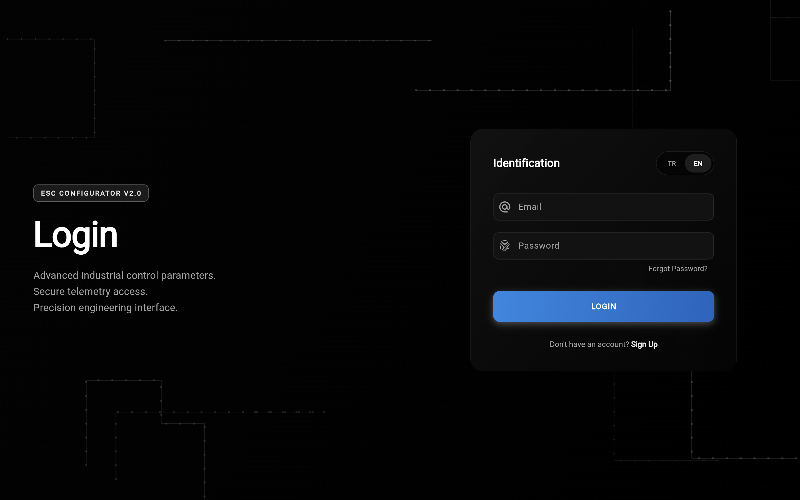

The secure login interface featuring:
- Email/password authentication
- Session management integration
- Professional dark theme with gradient accents
- Link to signup for new users

#### Sign Up Page
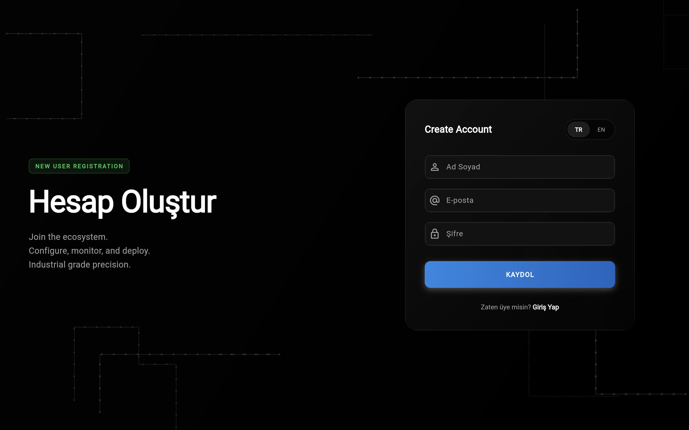

User registration interface with:
- Email verification workflow
- Password strength validation
- Account creation with profile setup
- Integration with authentication backend

---

## Battery Configuration

#### Battery Page - Standard Option (2S-12S)
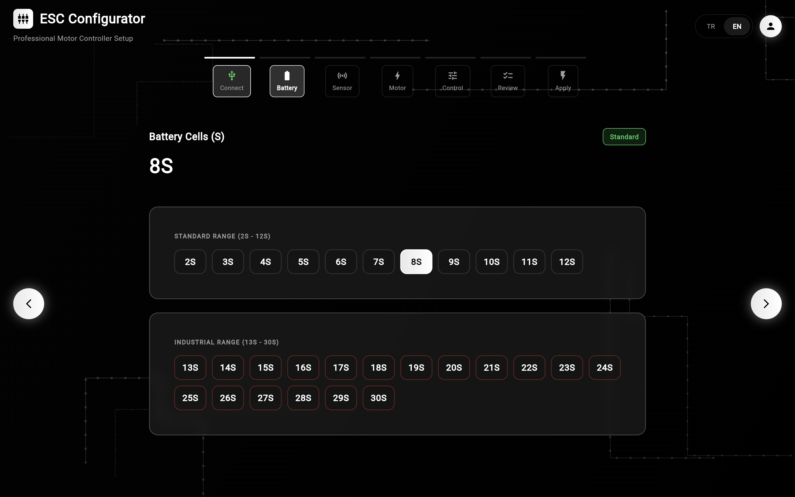

Standard battery range configuration showing:
- 8S cell selection (29.6V nominal)
- Green category badge for standard range
- Price-conscious applications
- Cell count: 2S through 12S available

#### Battery Page - Industrial Option (13S-30S)
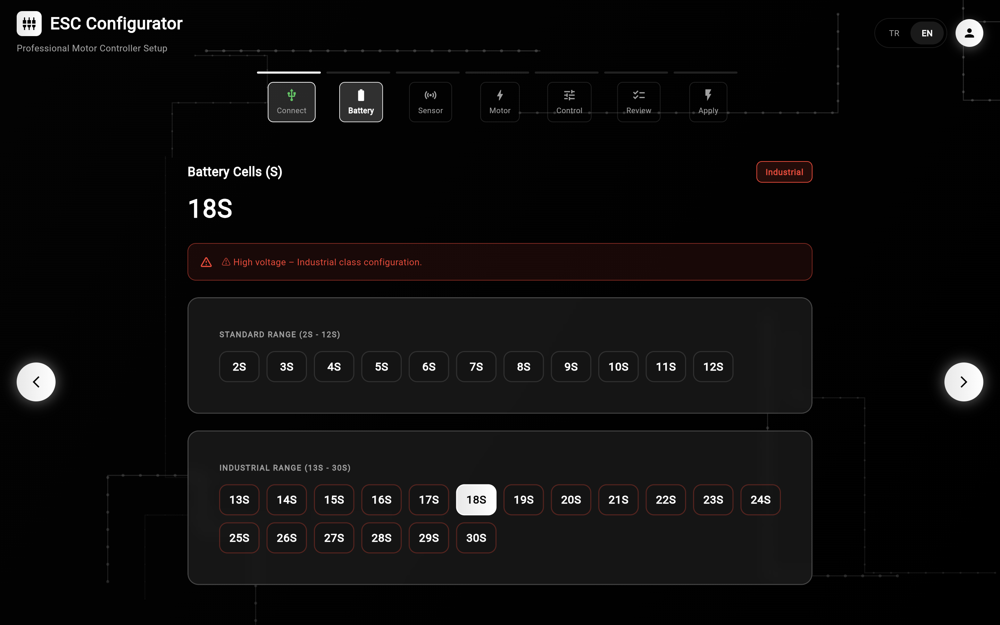

High-voltage industrial configuration demonstrating:
- 18S cell selection (64.8V nominal)
- Red warning indicator for high voltage
- Advanced applications requiring high power
- Cell count: 13S through 30S available

---

## Connection & Port Detection

#### Connect Page - Before Connection
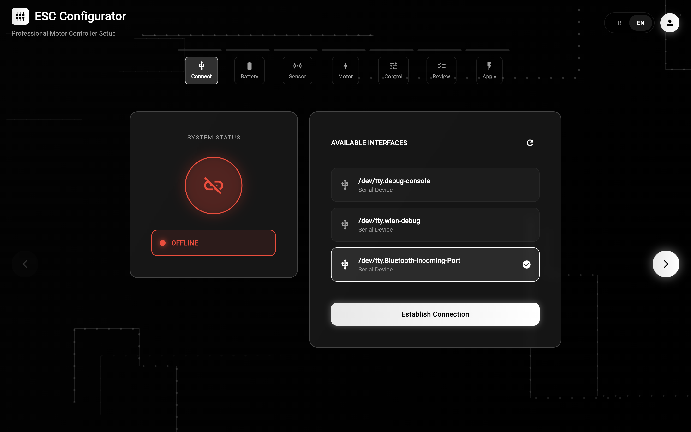

Port detection interface showing:
- Available serial communication ports
- ESC device detection status
- Manufacturer information for each port
- Ready-to-connect UI state

#### Connect Page - After Connection
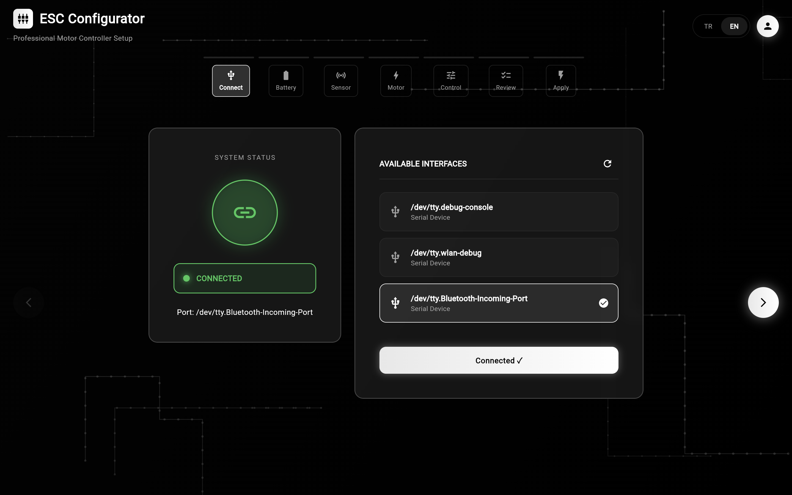

Successful connection confirmation displaying:
- Active port selection (highlighted)
- Real-time connection status indicator
- Connected port path and details
- Ready for next wizard step

---

## Motor Configuration

#### Motor Configuration Page


Motor specification interface including:
- Motor type selection (BLDC/PMSM)
- Pole pair configuration
- KV rating input
- Maximum current limits
- RPM field visibility controlled by sensor selection

---

## Sensor Configuration

#### Sensor Page - Encoder Option
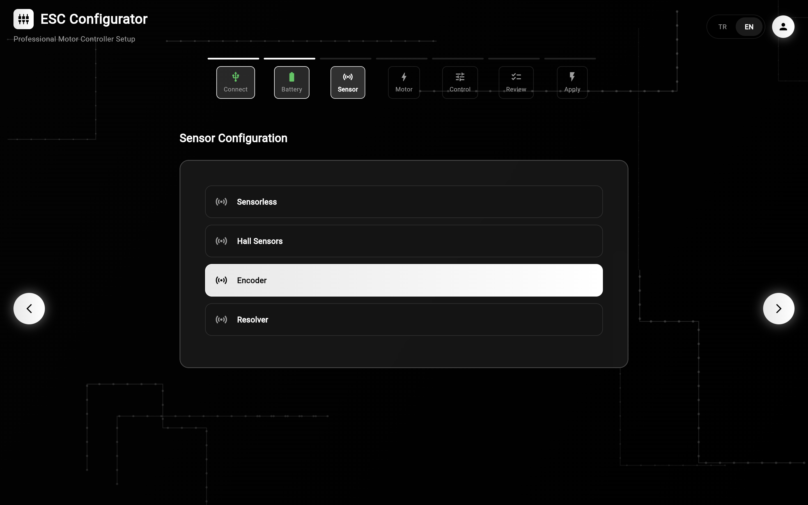

Sensor mode selection interface showing:
- Encoder mode configuration
- Alternative options (Sensorless, Hall, Resolver)
- Clear mode descriptions and use cases
- Impact on subsequent Motor step parameters

---

## Control & Protection

#### Control & Protection Page
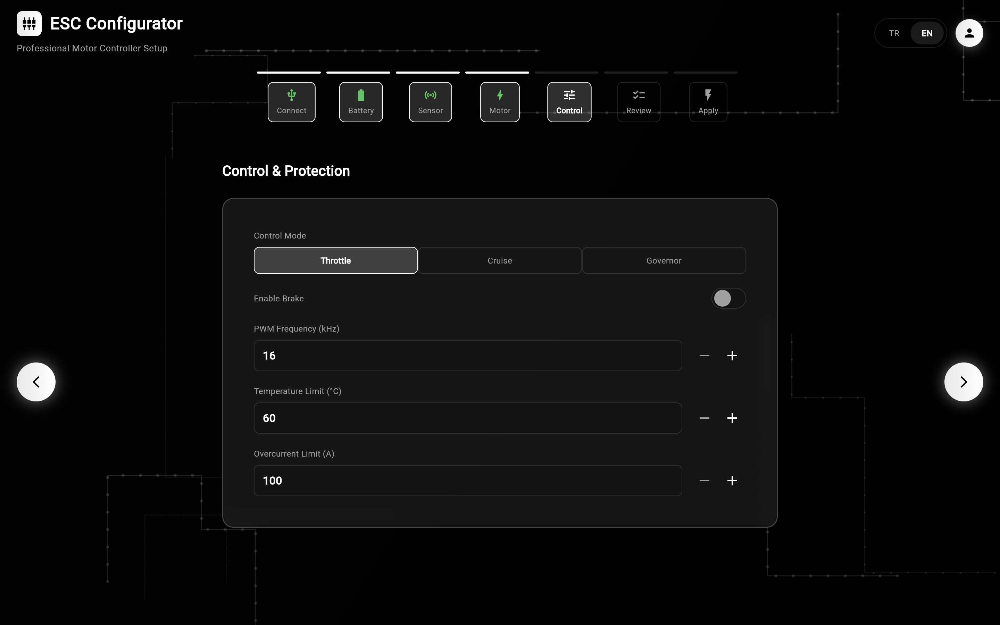

Advanced ESC parameter configuration:
- Control mode selection (Throttle/Cruise/Governor)
- Brake enable toggle
- PWM Frequency adjustment (8-32 kHz)
- Temperature limit configuration (50-120°C)
- Overcurrent limit protection

---

## Review & Deployment

#### Review Page
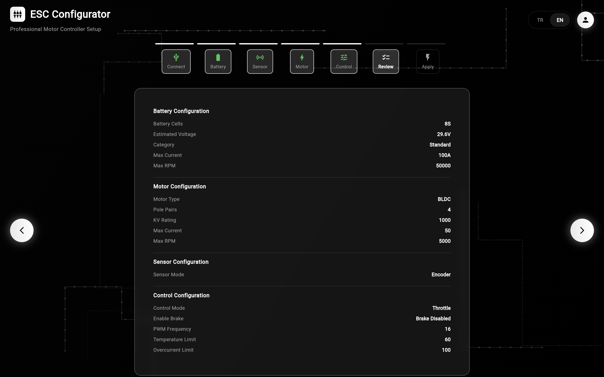

Comprehensive configuration summary displaying:
- All wizard step parameters
- Battery configuration validation
- Motor specifications verification
- Control settings overview
- Back-navigation to modify any step

#### Apply Page - Before Deployment
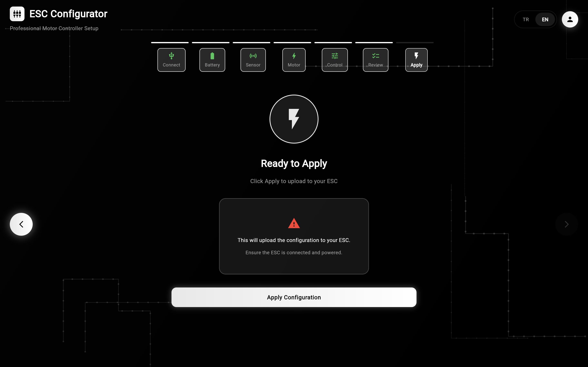

Pre-deployment interface showing:
- Final configuration summary
- Apply button ready for deployment
- Configuration ready state
- Confirmation before transmission

#### Apply Page - After Deployment
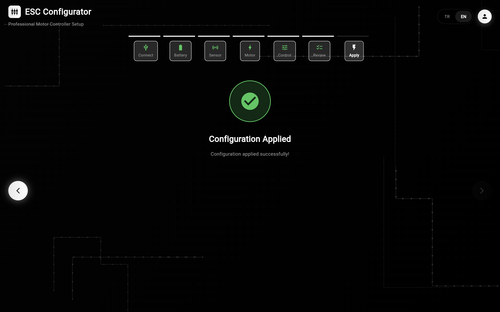

Success confirmation interface showing:
- Deployment completion status
- ESC device update confirmation
- Configuration saved notification
- System ready for next configuration

---

### User Profile

#### Profile Page
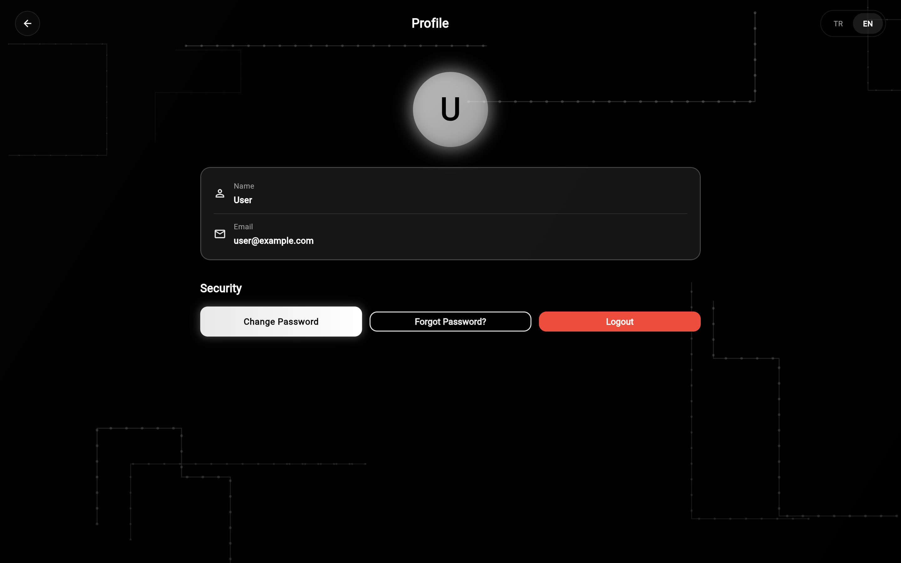

User account management interface providing:
- Profile information display (Name, Email)
- Password management options (Change Password, Forgot Password)
- Language selection (English/Turkish)
- Responsive button layout (horizontal on desktop, vertical on mobile)
- Secure logout functionality

---

## Architecture

### System Design

```
Client (Flutter Web)
    ↓
HTTP/REST API
    ↓
Node.js Backend (Express)
    ↓
MySQL Database
    ↓
Serial Port (ESC Communication)
```

### Data Flow

1. **Authentication Flow**
   - User credentials → Backend validation → JWT token → Session storage
   - Token included in all subsequent API requests

2. **Configuration Flow**
   - Wizard step → Provider state update → API submission
   - State persists across page navigation and browser refresh
   - Final configuration deployed to ESC via serial port

3. **Real-Time Updates**
   - Language change → Provider notification → All widgets rebuild
   - Port detection → Backend polling → UI automatic refresh
   - Configuration changes → Instant validation → User feedback

### State Management

The application uses **Provider package** for state management:

- **ESCProvider** - Centralized configuration and language state
- **SessionManager** - User authentication session handling
- **Consumer pattern** - Widgets automatically rebuild on state changes

---

## Key Features Explained

### 1. 7-Step Wizard with Smart Sequencing
- Connect → Battery → **Sensor** → **Motor** → Control → Review → Apply
- Sensor step positioned before Motor to enable conditional Motor field visibility
- RPM parameter hidden in Motor step when Sensorless mode selected

### 2. Responsive UI Design
- **Laptop (>700px):** Side-by-side layouts, horizontal button arrangement
- **Mobile (<700px):** Stacked layouts, vertical button arrangement
- Graceful adaptation using `LayoutBuilder` and `MediaQuery`

### 3. PCB Circuit Background
- Animated background with authentic PCB traces
- 70% perpendicular angles (0°, 90°, 180°, 270°)
- 30% diagonal angles (45°, 135°, 225°, 315°)
- Vignette overlay keeps content area clear
- Traces visible only on screen edges, not on content

### 4. Multi-Language System
- Real-time switching without page reload
- 100+ translation keys covering all UI elements
- Support for English and Turkish
- Infrastructure ready for additional languages

### 5. Battery Validation
- Standard range: 2S-12S (7.4V - 44.4V)
- Industrial range: 13S-30S (46.8V - 108V)
- Automatic category detection and warning system
- High-voltage warnings for industrial configurations

---

## API Endpoints

### Authentication
- `POST /auth/register` - User registration
- `POST /auth/login` - User login
- `POST /auth/verify-email` - Email verification
- `POST /auth/forgot-password` - Password reset request
- `POST /auth/change-password` - Change user password

### Configuration
- `POST /config/save` - Save ESC configuration
- `GET /config/:id` - Retrieve saved configuration
- `POST /config/apply` - Deploy configuration to ESC

### Port Management
- `GET /ports/available` - List available serial ports
- `POST /ports/connect` - Establish port connection
- `GET /ports/status` - Check connection status

---

## Troubleshooting

### Port Not Detected
- Ensure ESC device is connected via USB
- Check device drivers are installed
- Restart application and try again

### Configuration Won't Apply
- Verify ESC device connection is active
- Check battery voltage is appropriate for configuration
- Review all parameters in Review step

### Language Not Switching
- Clear browser cache and refresh
- Ensure database has all translation keys
- Check browser console for errors

---

## Development Guidelines

### Adding New Pages
1. Create new widget in `lib/ui/screens/`
2. Use `CinematicBackground` wrapper for consistent design
3. Implement responsive layout with `LayoutBuilder`
4. Add translations to `lib/localization/translations.dart`
5. Import Provider for state access

### Adding New Translations
```dart
// In translations.dart
static final Map<String, Map<String, String>> _translations = {
  'en': {
    'your_key': 'Your English text',
  },
  'tr': {
    'your_key': 'Turkish text',
  },
};
```

### Component Usage
```dart
// Use GradientButton for primary actions
GradientButton(
  label: 'Button Text',
  onPressed: () => { /* action */ },
);

// Use GlassyCard for content containers
GlassyCard(
  child: /* your content */,
);

// Use LanguageSelector for language switching
LanguageSelector(
  currentLang: lang,
  onSelect: (newLang) => { /* update */ },
);
```

---

## Performance Optimization

- Lazy loading of wizard steps
- Efficient state management with Provider
- Minimized re-renders using Consumer widgets
- Optimized PCB background animation
- Cached API responses for port detection

---

## Security Considerations

- JWT token-based authentication
- Session timeout after 30 minutes of inactivity
- Password hashing with bcrypt
- HTTPS enforcement in production
- Input validation on all forms
- SQL injection prevention via parameterized queries

---

## Future Enhancements

- Mobile app version (iOS/Android)
- Advanced telemetry dashboard
- Configuration templates library
- Multi-device management
- Firmware update delivery system
- Real-time parameter monitoring
- Configuration history and rollback
- Team collaboration features

---

## Contributing

This is a proprietary project for Turkish Motor Manufacturing. Internal contributions follow standard Git workflow:

1. Create feature branch: `git checkout -b feature/description`
2. Commit changes: `git commit -m "feat: description"`
3. Push to branch: `git push origin feature/description`
4. Create Pull Request for code review

---

## License

Proprietary software owned by Turkish Motor Manufacturing.  
Unauthorized copying or distribution is prohibited.

---

## Contact & Support

**Developer:** Mohammed Saleh  
**Company:** Turkish Motor Manufacturing  
**Project:** ESC Panel System v1.0  
**Repository:** [https://github.com/Alansi775/ESCPannelSystem](https://github.com/Alansi775/ESCPannelSystem)

---

## Deployment Checklist

- [ ] Environment variables configured
- [ ] Database migrations completed
- [ ] Backend server tested and running
- [ ] Frontend build optimized for production
- [ ] HTTPS certificate installed
- [ ] API endpoints verified
- [ ] Error handling tested
- [ ] Performance benchmarked
- [ ] Security audit completed
- [ ] Documentation reviewed
- [ ] User acceptance testing passed

---

**Last Updated:** January 19, 2026  
**Version:** 1.0 - Prototype Release  
**Status:** Ready for Initial Deployment
